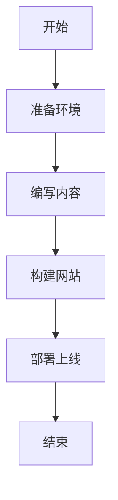

# 使用 Just the Docs 构建文档网站的最佳实践
{: .no_toc }

<details open markdown="block">
  <summary>
    目录
  </summary>
  {: .text-delta }
1. TOC
{:toc}
</details>

## 引言

[Just the Docs](https://just-the-docs.github.io/just-the-docs/) 是一个为文档设计的 Jekyll 主题，它提供了清晰的导航结构和丰富的功能，非常适合构建技术文档、API 文档或知识库。本文将分享使用 Just the Docs 构建文档网站的一些最佳实践和技巧。

## 基本设置

### 安装和配置

要使用 Just the Docs，最简单的方法是使用 [Just the Docs template](https://github.com/just-the-docs/just-the-docs-template/generate) 创建一个新的仓库。如果您想在现有的 Jekyll 网站上使用，可以按照以下步骤操作：

1. 在 `Gemfile` 中添加主题：
   ```ruby
   gem "just-the-docs"
   ```

2. 在 `_config.yml` 中设置主题：
   ```yaml
   theme: just-the-docs
   ```

3. 或者，如果您使用 GitHub Pages，可以使用远程主题：
   ```yaml
   remote_theme: just-the-docs/just-the-docs
   ```

### 基本配置选项

Just the Docs 提供了丰富的配置选项，以下是一些常用的配置：

```yaml
# 网站标题和描述
title: 我的文档网站
description: 一个使用 Just the Docs 主题的文档网站

# 启用搜索功能
search_enabled: true

# 设置颜色方案
color_scheme: light # 可选 dark

# 配置页脚内容
footer_content: "版权所有 &copy; 2025"
```

## 页面组织结构

### 层次导航

Just the Docs 的一大特点是支持多层次导航结构，您可以通过 front matter 中的 `parent` 和 `has_children` 属性来建立层次关系：

```yaml
---
layout: default
title: 父页面
nav_order: 2
has_children: true
---
```

```yaml
---
layout: default
title: 子页面
parent: 父页面
nav_order: 1
---
```

```yaml
---
layout: default
title: 孙页面
parent: 子页面
grand_parent: 父页面
nav_order: 1
---
```

### 自定义排序

您可以通过 `nav_order` 属性控制页面在导航菜单中的顺序。可以使用数字、字母或日期：

```yaml
---
nav_order: 1 # 数字排序
---
```

```yaml
---
nav_order: a # 字母排序
---
```

## 样式和格式

### 标签和提示框

Just the Docs 提供了多种标签和提示框样式：

{: .label }
默认标签

{: .label .label-green }
绿色标签

{: .label .label-yellow }
黄色标签

{: .label .label-red }
红色标签

{: .label .label-blue }
蓝色标签

{: .label .label-purple }
紫色标签

提示框用法：

{: .note }
这是一个普通提示框。

{: .warning }
这是一个警告提示框。

{: .important }
这是一个重要提示框。

### 代码块

Just the Docs 支持语法高亮的代码块：

```python
def hello_world():
    print("Hello, World!")
```

```javascript
function helloWorld() {
  console.log("Hello, World!");
}
```

## 高级功能

### 自定义 JS 和 CSS

您可以通过在 `_includes` 目录下创建 `head_custom.html` 文件来添加自定义 JS 和 CSS：

```html
<!-- 自定义 CSS -->
<link rel="stylesheet" href="{{ '/assets/css/custom.css' | relative_url }}">

<!-- 自定义 JS -->
<script src="{{ '/assets/js/custom.js' | relative_url }}"></script>
```

### 添加 Mermaid 图表支持

Just the Docs 可以与 Mermaid.js 集成，实现流程图、时序图等功能：



## 结论

Just the Docs 是一个功能丰富、易于使用的文档主题，可以帮助您快速搭建一个专业的文档网站。通过本文介绍的最佳实践，希望能帮助您更好地使用 Just the Docs 构建自己的文档系统。

## 参考资料

- [Just the Docs 官方文档](https://just-the-docs.github.io/just-the-docs/)
- [Jekyll 官方网站](https://jekyllrb.com/)
- [GitHub Pages 文档](https://docs.github.com/en/pages)